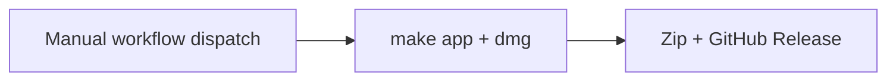

# Building CodexBar

CodexBar is built with **Swift Package Manager** (SPM). No Xcode project is required.

## Minimal setup

You only need **Xcode Command Line Tools**:

```bash
xcode-select --install
```

### Quick start

```bash
make build          # or: swift build -c release
make run            # builds + launches .build/CodexBar.app (release)
make run-debug      # debug build + launch
make app            # creates dist/CodexBar.app + DMG
make install        # copy dist/CodexBar.app to /Applications/
```

You can also run the raw binary:

```bash
swift build -c release
./.build/release/CodexBar
```

`make run` uses `scripts/build-dev-app.sh` for a lightweight `.app` wrapper; `make app` produces a full `dist/CodexBar.app` for distribution. Both wrappers generate `AppIcon.icns` from the root `AppIcon.png` so Dock, app switcher, and confirmation dialogs use the CodexBar icon.

## Packaging

```bash
make app     # creates dist/CodexBar.app + dist/CodexBar-macOS.dmg
make dmg     # same, with optional signing/notarization from .env
```

Output:

- `dist/CodexBar.app`
- `dist/CodexBar-macOS.dmg`

GitHub release assets use versioned names, e.g. `CodexBar-v1.0.0.app.zip` and `CodexBar-v1.0.0-macOS.dmg`. The in-app updater downloads `CodexBar-{tag}.app.zip` from the newest **notarized** release only (`v{VERSION} (Notarized)` title or notarization phrase in release notes). Unsigned CI releases are for manual install.

## Scripts

| Script | Purpose |
|--------|---------|
| `scripts/build-macos-app.sh` | Assemble `dist/CodexBar.app`, optional `--sign` |
| `scripts/build-dev-app.sh` | Lightweight `.build/CodexBar.app` for `make run` |
| `scripts/codesign-app-bundle.sh` | Ad-hoc or Developer ID codesign with `entitlements.plist` |
| `scripts/notarize.sh` | Submit signed app to Apple notary service + staple |
| `scripts/release.sh` | Local GitHub release publish (`make release`) |
| `scripts/codexbar-install-update.sh` | Bundled helper for in-app update install (`Contents/Resources/codexbar-install-update`) |

## Codesigning / distribution

### Local config (`.env`)

```bash
cp .env.example .env
# edit .env with your SIGN_IDENTITY and NOTARY_PROFILE
```

`.env` is gitignored. The Makefile loads it automatically (`-include .env`).

```bash
make signed
make notarize
make dmg
make release RELEASE_TYPE=notarized
```

### Unsigned builds

macOS may block unsigned apps on first open:

1. Right-click `CodexBar.app` → **Open**
2. `xattr -cr /Applications/CodexBar.app`
3. System Settings → Privacy & Security → **Open Anyway**

## Versioning

Update `VERSION` before `make release`. The release tag must match (`v` + contents of `VERSION`).

## GitHub Releases

There are two ways to publish a release: **GitHub Actions** (recommended) or **local `make release`**. Use one path per version — not both at once.

Release title format (both paths):

- `v{VERSION} (Notarized)` — signed + notarized; recommended for distribution
- `v{VERSION} (Unsigned)` — development builds; Gatekeeper workarounds in release notes

### CI (unsigned)

Workflows: `.github/workflows/pr.yml` (PR checks), `.github/workflows/release.yml` (unsigned publish).

**PR checks:** run automatically on pull requests to `main` (`make test` + `make app`).

**Release trigger:** **Actions → Release → Run workflow** (manual dispatch only). Builds unsigned `.app` + DMG; no Apple secrets required.

Inputs:

- `version`: optional tag override; must match `VERSION` (e.g. `v1.0.0`)

Steps before dispatch:

1. Bump `VERSION`.
2. Commit and push to the branch you are releasing from.



Release title: `v{VERSION} (Unsigned)`. Notes include Gatekeeper bypass instructions.

**Notarized releases:** use local `make release RELEASE_TYPE=notarized` with `.env` (`SIGN_IDENTITY`, `NOTARY_PROFILE`). CI does not sign or notarize.

See `.github/workflows/README.md` for step-by-step workflow reference.

### Local (`make release`)

For publishing entirely from your Mac (requires [GitHub CLI](https://cli.github.com/) authenticated with `gh auth login`):

```bash
# 1. Bump VERSION, commit
# 2. Publish unsigned release (default)
make release
```

`make release` runs `scripts/release.sh`: builds, zips, creates/updates the GitHub release, and pushes tag `v{VERSION}` if needed.

**Notarized local release** (with `.env` configured):

```bash
make release RELEASE_TYPE=notarized
```
