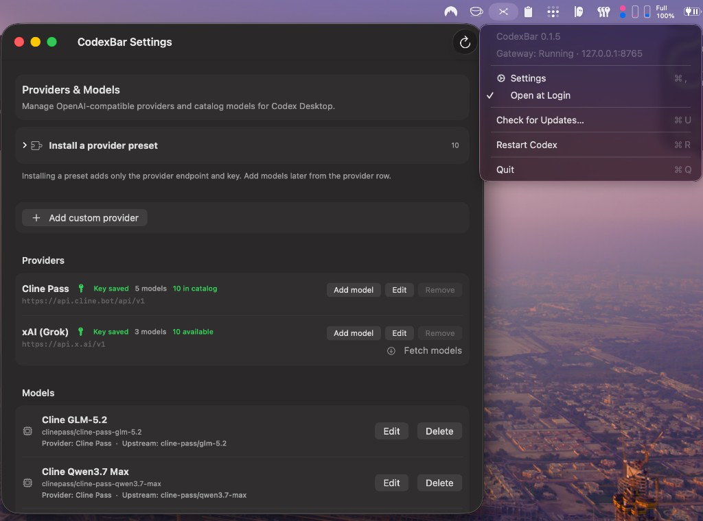

# CodexGateway

**Use any OpenAI-compatible model in Codex Desktop and Codex CLI — from a macOS menu bar app.**

Codex Desktop and the Codex CLI normally talk only to OpenAI's own models. CodexGateway sits quietly in your menu bar and runs a tiny local gateway that lets both route to **third-party providers** (xAI API key, Grok OAuth via the official Grok CLI, DeepSeek, OpenRouter, Z.ai, Kimi, Qwen, MiniMax, Cline Pass, …) or **local models** (Ollama) — while still passing native GPT/ChatGPT requests straight through to OpenAI. You configure providers and models in a native **Settings** window; Desktop and CLI then share the same gateway via `~/.codex/config.toml`.



> **Formerly CodexBar.** The app was renamed to **CodexGateway**. Existing installs keep your providers and keys — see [Upgrading from CodexBar](#upgrading-from-codexbar).

> Most providers must expose an OpenAI-compatible `/chat/completions` endpoint. (Cursor's API, for example, only lists models and has no public chat-completions endpoint, so it can't be used here.) **xAI Grok (OAuth)** is the exception: it reuses your Grok CLI login and talks to xAI's CLI chat proxy instead of storing an API key.

---

## How it works

```text
Codex Desktop          Codex CLI
     │                      │
     └──────────┬───────────┘
                │  HTTP (loopback)
                ▼
     CodexGateway gateway — 127.0.0.1:8765
                │
                ├─ custom model → third-party provider API   (Responses ⇄ Chat Completions)
                └─ native GPT   → OpenAI / ChatGPT backend    (passed through unchanged)
```

- **Gateway** — a small embedded Swift HTTP server on `127.0.0.1:8765` (loopback only). Desktop and CLI are pointed at it via a managed block in `~/.codex/config.toml` (same config for both).
- **Routing** — requests for your custom models are translated (OpenAI *Responses* ⇄ *Chat Completions*) and forwarded to the provider's API with your key; native models are passed through to OpenAI/ChatGPT unchanged.
- **Menu bar + Settings** — a status icon shows gateway health and port; Settings is where you add providers, pick models, and sync the catalog Codex Desktop/CLI read.

## Features

- **Third-party & local models in Codex Desktop and CLI** via Responses ⇄ Chat Completions translation
- **Shared model catalog** — Settings exports models into `~/.codex` so Desktop’s picker and the CLI both see them
- **Native GPT pass-through** — official OpenAI / ChatGPT requests are untouched
- **No Codex sign-in needed for local-only use** (e.g. Ollama); sign-in is only required for native GPT/ChatGPT
- **Menu bar status** with live gateway state + port, and a native Settings window
- **Open at Login** — optional menu-bar toggle so CodexGateway starts with macOS
- **Friendly model names** auto-generated from provider model IDs (editable)
- **Loopback-only gateway** — no management endpoints over HTTP, nothing reachable from the LAN
- **In-app updates** from GitHub Releases (one-click install for notarized builds)

## Requirements

- macOS 26 or later
- [Codex Desktop](https://openai.com/codex) and/or the [Codex CLI](https://openai.com/codex) installed
- Xcode Command Line Tools (only if building from source)

## Install

Download the latest `.dmg` from [Releases](https://github.com/rimusz/codex-gateway/releases), or build from source:

```bash
make run            # build + launch the menu bar app
make app            # build dist/CodexGateway.app + DMG
make install        # copy the app to /Applications/
```

See [BUILDING.md](BUILDING.md) for packaging, code signing, notarization, and publishing releases.

## Upgrading from CodexBar

> **Name change:** **CodexBar** is now **CodexGateway** (menu bar title, `.app` bundle, and Settings window).

Existing installs upgrade smoothly:

- **Install the new app** from [Releases](https://github.com/rimusz/codex-gateway/releases) or use **Check for Updates…** in the menu bar (in-app update works from notarized CodexBar builds too).
- **Your settings are kept** — providers, models, and keys migrate from `~/.codexbar` to `~/.codexgateway` on first launch; no re-configuration needed.
- **Bundle ID changed** to `com.rimusz.CodexGateway` — macOS treats this as a new app. If you had **Open at Login** enabled, turn it on again from the menu bar after upgrading.
- **Codex config is updated** — the managed block in `~/.codex/config.toml` is rewritten from `codexbar` → `codexgateway` on **Update Gateway Config** or when an existing managed block is refreshed automatically.
- **On first launch or in-app update**, `CodexBar.app` in `/Applications` is replaced by `CodexGateway.app` (the legacy copy is removed).

## Quick start

1. Launch CodexGateway — a status icon appears in the menu bar.
2. (Optional) Menu bar → **Open at Login** so the gateway starts automatically after reboot.
3. Open **Settings** (menu bar → Settings, or ⌘,).
4. **Install a provider preset** and enter its API key (skipped for Ollama and **xAI Grok (OAuth)** — OAuth uses `grok login` / `~/.grok/auth.json`).
5. Click **Add model** on the provider row and pick the models you want (Grok OAuth seeds a suggested model on install).
6. Restart Codex when prompted (**Restart Codex**, ⌘R) so Desktop/CLI reload config.
7. Pick a model in **Codex Desktop** (model picker) or the **Codex CLI** — your custom models are available in both.

> **Custom models require you to be signed in to Codex** — a **free account is enough**. Signed out, Codex only shows its built-in fallback models and labels any active custom model as "Custom". (Native GPT/ChatGPT models still need an OpenAI/ChatGPT account.) When you have custom models but Codex is signed out, Settings shows a reminder.

## Managing providers & models

Everything lives in the **Settings** window — no browser needed.

### Providers

Install a built-in preset (**Z.ai, Kimi, Qwen, Xiaomi MiMo, Cline Pass, MiniMax, DeepSeek, xAI Grok (API), xAI Grok (OAuth), OpenRouter, Ollama**) or add a custom OpenAI-compatible endpoint. You're prompted for an API key when the provider needs one. Provider rows show a compact model count and status.

**xAI Grok (API) vs xAI Grok (OAuth):** keep them separate. **xAI Grok (API)** uses an API key against `api.x.ai` and fetches models from that API. **xAI Grok (OAuth)** uses the official Grok CLI session (`npm i -g @xai-official/grok` then `grok login`), forwards through xAI’s CLI chat proxy, and fetches the model list from the CLI OAuth catalog (`/models-v2`) — no key in `providers.json`. Both can be installed side by side.

You can add, edit, and delete providers. A provider can't be removed while it still has installed models — delete its models first.

### Models

Click **Add model** to fetch the provider's model list and choose which to install. Cline Pass uses Cline's public recommended-models feed (no API key required for listing).

Display names are auto-formatted into friendly, provider-prefixed names — Cline style:

| Provider model ID | Shown in Codex as |
|---|---|
| `grok-4.5` (xAI API) | **xAI Grok 4.5 (API)** |
| `grok-4.5` (xAI OAuth) | **xAI Grok 4.5 (OAuth)** |
| `deepseek/deepseek-chat-v3-0324` (OpenRouter) | **OpenRouter DeepSeek Chat V3 0324** |

Doubled vendor prefixes are collapsed, and any name you edit yourself is preserved.

### When does Codex need a restart?

Only when you **add, edit, or delete a model** — those change Codex's exported model catalog (Desktop picker + CLI), and Settings will surface a **Restart Codex** button. **Provider** changes (including installing a preset) take effect **immediately** — the gateway reads endpoints and keys live from `~/.codexgateway/providers.json`, so no restart is required.

The menu-bar **Restart Codex** action (⌘R) always asks for confirmation first.

### Open at Login

Menu bar → **Open at Login** toggles whether CodexGateway launches when you sign in to macOS (via `SMAppService`). A checkmark means it is enabled. The first time you turn it on, macOS may ask you to allow CodexGateway under **System Settings → General → Login Items & Extensions** — CodexGateway offers a shortcut to that pane when approval is required.

### Reset / Update Gateway Config

This button toggles based on whether Codex's config already matches your CodexGateway models:

- **Reset Gateway Config** (in sync) — removes *only Codex's* managed block + exported catalog so Codex stops routing through CodexGateway. **Your `~/.codexgateway` providers and models are kept.**
- **Update Gateway Config** (out of date, e.g. after a reset or newly added models) — re-applies your providers/models to Codex.

Either action restarts Codex.

## Security & networking

The gateway binds to `127.0.0.1` only, so it is **never reachable from the local network**. It exposes just the routes Codex and the app use (`/health`, `/v1/responses`, `/v1/chat/completions`, `/v1/models`, `/api/restart-codex`) — there are **no HTTP endpoints for changing providers or models**. All management happens in-process through the native Settings UI.

## Configuration files

CodexGateway keeps its own data under `~/.codexgateway/` and writes only a clearly-marked managed block into Codex's config.

| Path | Purpose |
|---|---|
| `~/.codexgateway/providers.json` | Provider endpoints + API keys (read live by the gateway) |
| `~/.codexgateway/custom_model_catalog.json` | Your installed models + routing metadata |
| `~/.codexgateway/fetched_models.json` | Cache of provider model lists |
| `~/.codex/config.toml` | Codex config — CodexGateway patches a managed block only |
| `~/.codex/model-catalogs/custom-providers.json` | Codex model catalog export for Desktop + CLI (native models **plus** your custom ones) |

The exported catalog always includes the native ChatGPT/Codex models, so installing CodexGateway never hides the built-in choices in Desktop or CLI.

## Updates

Menu bar → **Check for Updates…** (⌘U) checks GitHub for a newer **notarized** release and can **download, verify, install, and relaunch** in one flow (same pattern as [GrokBuild Desktop](https://github.com/rimusz/grok-build-desktop)):

1. **Update App** — downloads `CodexGateway-{tag}.app.zip` and verifies the signature (legacy `CodexBar-{tag}.app.zip` is also published for older updaters)
2. **Install and Restart** — replaces the running app via the bundled `codexgateway-install-update` helper and relaunches  

Only **notarized** releases with a `.app.zip` asset are installable in-app (**Update App**). Unsigned CI releases are ignored (use the DMG from GitHub manually). If the panel says an update is available but only offers **Open Release Page**, the GitHub release is missing the `CodexGateway-{tag}.app.zip` asset. If you previously chose **Skip This Version**, **Check for Updates…** still offers **Update App** so you can install later.

Unsigned CI releases are published for manual install only.

## Using CodexGateway with [Zero](https://zero.gitlawb.com)

[Zero](https://zero.gitlawb.com) is a terminal coding agent that supports any **OpenAI-compatible** API. You can point it at the CodexGateway gateway on the same Mac and use the models you configured in CodexGateway Settings — Cline Pass, Ollama, DeepSeek, xAI via your keys, and so on.

CodexGateway must be **running** (menu bar icon present). The gateway is local-only:

| Item | Value |
|------|--------|
| Base URL | `http://127.0.0.1:8765/v1` |
| Health | `http://127.0.0.1:8765/health` |
| Model list | `GET http://127.0.0.1:8765/v1/models` |

Provider API keys live in CodexGateway (`~/.codexgateway/providers.json`); Zero only needs a **dummy** credential so its `custom-openai-compatible` profile passes auth checks.

### Prerequisites

1. CodexGateway is running and the gateway is healthy:

   ```bash
   curl -s http://127.0.0.1:8765/health
   ```

2. Models are installed in **CodexGateway → Settings** (providers + models, **Update Gateway Config** if needed).

3. [Zero](https://zero.gitlawb.com) is installed (`npm install -g @gitlawb/zero` or see Zero's install docs).

### One-time setup (CLI)

Add CodexGateway as a **Custom OpenAI-compatible** provider. Use catalog id `custom-openai-compatible` (not a made-up name like `codexgateway`):

```bash
zero providers add custom-openai-compatible \
  --name codexgateway \
  --base-url http://127.0.0.1:8765/v1 \
  --model clinepass/cline-pass-glm-5.2 \
  --auth-header-value not-used \
  --set-active
```

- `--name codexgateway` — your profile label (any name you like).
- `--model` — default model slug; pick one from `zero providers models codexgateway` (see below).
- `--auth-header-value not-used` — stored dummy key (CodexGateway ignores it for custom models; Zero requires *something* for this profile type).

**Alternative:** set an env var instead of storing a key:

```bash
export OPENAI_API_KEY=not-used
zero providers add custom-openai-compatible \
  --name codexgateway \
  --base-url http://127.0.0.1:8765/v1 \
  --model clinepass/cline-pass-glm-5.2 \
  --api-key-env OPENAI_API_KEY \
  --set-active
```

### Verify setup

```bash
zero providers check codexgateway --connectivity
zero providers models codexgateway
zero providers current
```

You want `status: ok` and `connectivity: pass`. `zero providers models codexgateway` lists every slug the gateway exposes (custom + native GPT slugs).

### CLI — providers & models

| Command | Purpose |
|---------|---------|
| `zero providers list` | All saved provider profiles |
| `zero providers current` | Active provider + model |
| `zero providers use codexgateway` | Switch to the CodexGateway profile |
| `zero providers models codexgateway` | Live list from CodexGateway `/v1/models` |
| `zero providers check codexgateway --connectivity` | Auth + reachability |
| `zero providers catalog` | Built-in provider types (`custom-openai-compatible`, etc.) |

**Change default model** on the profile (re-run add with a new `--model`):

```bash
zero providers add custom-openai-compatible \
  --name codexgateway \
  --base-url http://127.0.0.1:8765/v1 \
  --model clinepass/cline-pass-kimi-k2.7-code \
  --auth-header-value not-used \
  --set-active
```

### CLI — run tasks (headless)

```bash
# One-shot prompt (uses active provider unless --model overrides)
zero exec "explain this repo"

# Explicit model slug from CodexGateway
zero exec --model clinepass/cline-pass-glm-5.2 "fix the failing test in ./pkg"

# Scriptable / CI-style I/O
zero exec --output-format stream-json "summarize main.go"
```

Model slugs must match **`zero providers models codexgateway`** exactly (e.g. `clinepass/cline-pass-glm-5.2`, not the raw Cline Pass upstream id).

### TUI — interactive terminal

Start Zero with the **codexgateway** profile already active (do this in a normal terminal, not inside the TUI):

```bash
zero providers use codexgateway
zero
```

If you used `--set-active` when you ran `zero providers add`, **codexgateway** is already the active profile — you can run `zero` directly. Check anytime:

```bash
zero providers current
```

Inside the TUI, `/config` or the bottom status line shows the active provider and model (you want **codexgateway** · your model slug).

> **`/provider` is for managing providers** (add / edit / delete), not for switching. Use **`zero providers use codexgateway`** in a shell before launching `zero`, or rely on `--set-active` from setup.

#### Changing the model in TUI

CodexGateway models are **not** reliably listed in Zero's `/model` search picker. Use one of these methods instead:

**Method 1 — `/model <slug>` (best for switching mid-session)**

1. Confirm **codexgateway** is active (status bar or `/config`). If not, exit the TUI and run `zero providers use codexgateway`, then `zero` again.

2. In another terminal, list valid slugs:

   ```bash
   zero providers models codexgateway
   ```

3. In the Zero TUI, switch model by typing the **full slug** (no picker needed):

   ```text
   /model clinepass/cline-pass-glm-5.2
   ```

   Other examples:

   ```text
   /model clinepass/cline-pass-kimi-k2.7-code
   /model clinepass/cline-pass-deepseek-v4-pro
   /model gpt-5.4
   ```

4. Confirm the switch — Zero prints a status line showing the new model. The status bar at the bottom of the TUI also updates (provider · model).

**Method 2 — Set default before starting Zero (CLI)**

Change the profile's default model, then launch `zero`:

```bash
zero providers add custom-openai-compatible \
  --name codexgateway \
  --base-url http://127.0.0.1:8765/v1 \
  --model clinepass/cline-pass-kimi-k2.7-code \
  --auth-header-value not-used \
  --set-active

zero
```

New sessions start on that model. Use **Method 1** to switch again without restarting.

**Method 3 — `/model` picker + Recent**

After you switch with `/model <slug>` once, that model appears under **Recent** in `/model` for quicker re-selection. The graphical picker may still not show Cline Pass models when you search — use Recent or type the slug directly.

#### Other TUI / CLI commands

| Action | How |
|--------|-----|
| Switch to CodexGateway provider | **`zero providers use codexgateway`** (in shell, before or after exiting TUI) |
| Add/edit providers in TUI | `/provider add` or `/provider` (manager — not for picking active provider) |
| Show active provider + model | `/config` or bottom status line; CLI: `zero providers current` |
| List models | `zero providers models codexgateway` |
| Check setup | `/doctor` or `zero doctor` |

**`/model` picker limitation:** Zero's graphical model picker uses a static placeholder catalog for `custom-openai-compatible` and often **does not list** CodexGateway's live models (searching `cline` may show "no matching models"). This is a Zero behavior, not a CodexGateway bug.

CodexGateway models appear under provider group **"Custom OpenAI-compatible"** in `/model`, not "CodexGateway". Sections like **xAI** or **MiniMax** in the picker are **other** Zero profiles talking directly to those APIs, not through CodexGateway.

### Troubleshooting

| Symptom | Fix |
|---------|-----|
| `unknown provider "codexgateway"` on `providers add` | Use catalog id **`custom-openai-compatible`**, not `codexgateway`. |
| `unknown flag "--api-key"` | Use **`--auth-header-value`** or **`--api-key-env`**, not `--api-key`. |
| `requires API credentials` / connectivity fail | Set **`--auth-header-value not-used`** or `export OPENAI_API_KEY=not-used`. |
| `zero providers models` works but TUI picker is empty | Use **`/model <full-slug>`** inside TUI (see **Changing the model in TUI** above). |
| Wrong provider active (xAI, MiniMax, etc.) | Exit TUI; run **`zero providers use codexgateway`**, then **`zero`** again. |
| Connection refused | Start CodexGateway; confirm `curl http://127.0.0.1:8765/health`. |
| Model not found at runtime | Slug must match `zero providers models codexgateway`; re-export from CodexGateway Settings if you added models recently. |

## Contributing

CodexGateway is a pure-Swift SwiftPM app (no Xcode project). See [ARCHITECTURE.md](ARCHITECTURE.md) for the app map, gateway routes, config paths, and a "common tasks → files" lookup, and [AGENTS.md](AGENTS.md) for repo conventions.

## Licence

[Apache License 2.0](LICENSE). CodexGateway is an independent macOS menu-bar app with a local gateway for [Codex Desktop](https://openai.com/codex/) and CLI; it is not affiliated with, endorsed by, or sponsored by OpenAI.
